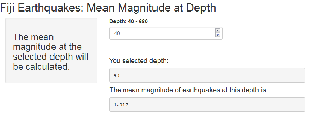

## Fiji Earthquakes -- Mean Magnitude at Depth

This shiny application is a learning experiance for Coursera`s Data Scientist Specialization Developing Data Products course.

---  

## The Data

The data is from the R Data package (datasets) quake data set. The description of the data can be found at [https://stat.ethz.ch/R-manual/R-devel/library/datasets/html/quakes.html](https://stat.ethz.ch/R-manual/R-devel/library/datasets/html/quakes.html).

(Excerpt from above website) :
> This is one of the Harvard PRIM-H project data sets. They in turn obtained it from Dr. John Woodhouse, Dept. of Geophysics, Harvard University. 

---

## The Application

1. The user selects the depth from the list. 
2. The server subsets the quake data.frame for the selected depth.
3. The mean magnitude at that depth is displayed.
  
  

---

## Mean Magnitude or No Data

One thing to note about the display of the mean. If there was no data found in the quake data.frame for that depth a note will be displayed stating this fact.

Example of no data: depth=73

``` {r}
    # subset the main data (quakes) to the selected depth
    quakesAtXDepth <- subset.data.frame(quakes, depth == 73, na.rm = TRUE)
  
    # if the subset has rows (there was an earthquake at that depth)
    hasQuakes <- nrow(quakesAtXDepth)
    
    if(hasQuakes == 0) {  
      
      #reort there was no earthquakes at that depth
      "There is no earthquake observations at this depth."
    }
```

